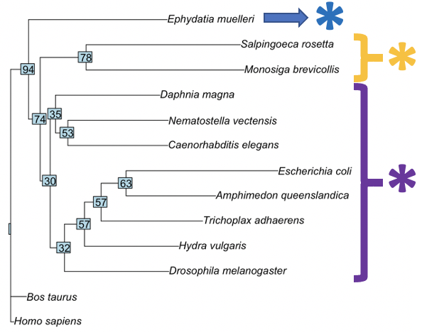

# Phylogenetic Biology - Final Project

# Investigating collagen type IV phylogenetics in our most distant animal relatives to gain insight on extracellular matrix evolution

## Introduction and Goals

The extracellular matrix (ECM) prevalent in animals today emerged at the transition from unicellular organisms to multicellularity, a revolutionary moment in metazoan evolution. Particularly in animal multicellularity, the ECM gave animals the advantage of developing larger bodies to defend themselves from predators, more space to store nutrients, and the ability to develop specialized tissues. Over metazoan evolution, this extracellular material also led to the development of incredible biomaterials from these specialized tissues. The animal kingdom can be described as the kingdom of diverse biomaterials, exemplified throughout evolution in the viscoelastic bodies of sponges, defensive hagfish slime, tendons for movement, and skin for isolation and protection. While the ECM has allowed for the wide diversification of animal function and form, not much is understood about how the ECM has developed over the course of metazoan evolution. 

In unicellular organisms, molecules mostly exist in solution or as intracellular condensates. On the other hand, multicellular organisms often form macroscopic, or bulk, amounts of ECM material. Biochemically and biophysically, this transition is non-trivial – how do organisms develop and maintain this material that lacks cells? This question is especially interesting when considering that the bodies of our most distant animal relatives, such as ctenophores (comb jellies) and cnidarians, are largely made of extracellular material. Considering that these animals are our most distant animal relatives, how and when did the ECM originate? A significant amount of research about the transition to multicellularity has focused on cellular processes (e.g. Maldonado 2005, Brunet & King 2017, Ratcliff et al. 2012), despite that the extant animals closest to this transition often have more voluminous extracellular material than cellular material. Therefore, my overall objective is to investigate the molecular composition and phylogenetics of the ECM in our most distant animal relatives to gain insight into the origins of the ECM.

Since ctenophores are one of our most distant animal relatives (Wallberg et al. 2004, Halanych 2015), if not one of the earliest-diverging animals extant (Ryan et al. 2013, Dunn et al. 2008), and their bodies mostly comprise extracellular material (Pang & Martindale 2008), I plan to use them for investigating ECM components and evolution. Specifically, the largest portion of the ctenophore body is a gelatinous layer in between the epidermis and gastrodermis called a mesoglea, which is composed of bulk ECM, that makes them especially interesting for an ECM study (Pang & Martindale 2008). The classic ECM toolkit consists of many proteins that form the full matrix, including collagens (types I, IV, XV, XVIII), integrins, laminins, and fibronectins, that are conserved throughout metazoans (Ozbek et al. 2010, Hynes 2012). Collagens are typically the hallmark component of the ECM, so I will focus on collagens for my study and specifically, I will work with collagen type IV because it is one of the most common collagens in the ECM that allows for network formation (Sherman et al. 2015, Fidler et al. 2018). 

Interestingly, despite consisting of bulk ECM, ctenophores have not been found to have most of these conserved ECM proteins (Fidler et al. 2017). Genetic studies have extrapolated that collagen IV must be present in ctenophores because ctenophore genomes contain the non-collagenous 1 (NC1) regions associated with collagen type IV, but these studies have not found any other types of collagens (Fidler et al. 2017). Although, preliminary collagen IV staining studies in the Sweeney group observed that collagen IV was prevalent in the epithelium of ctenophores, but sparse in the mesoglea. This further confounds the ECM of ctenophore mesoglea, as it does not appear to be made of any of the usual ECM components. For comparison, other distant animal relatives, such as porifera and placazoa, contain collagen IV, other collagens, and spongin, another collagen-like protein (Fidler et al. 2017). From this, if ctenophores are the sister to all other animals, then they may have diverged before the development of the common ECM toolkit. Alternatively, if porifera are the sister to all other animals, then it appears ctenophores must have lost the common ECM toolkit. Either way, it is astounding that ctenophores appear to have developed a body made of mostly extracellular material, yet they have a mysterious mesoglea composition that seems to lack common ECM proteins. 
  
To begin unravelling the mystery of the contents of ctenophore mesoglea, I propose to investigate the phylogenetics of collagen IV in the unicellular relative choanoflagellates and many multicellular metazoan taxa including ctenophores, sponges, and cnidarians to evaluate the origins of the collagen IV-based ECM in metazoans. It may be possible that ctenophores contain some collagen IV genes that allow for a basic ECM to exist in the epithelium, but that it does not contain the appropriate types of collagen IV for bulk ECM to be bult in the mesoglea. Fidler et al. 2017 began to tackle this question by investigating the presence of collagen IV in many early-branching taxa. They built a maximum likelihood tree using genetic data from the NC1 (non-collagenous type 1) domains of collagen type IV genes. NC1 domains are a common component of collagen IV that are used to recognize other collagen IV molecules to build the ECM network. They found that ctenophores contain a multitude of diverse NC1 domains, so they chose to build a tree from the NC1 domains, where they found that some porifera have their own NC1 domain associated with spongin, but that the NC1 domain of ctenophores is conserved in other porifera, cnidarians, and bilaterians, identifying that this part of collagen IV is present in nearly all early evolution animals (Fidler et al. 2017). This helps clarify the development of the ECM, but does not directly answer the question of when collagen IV emerged. To answer this question, I will build a tree from collagen IV sequences. In most animals there are six types of collagen IV, called alpha chains (Boudko et al. 2018). I plan to build trees based on each type of alpha chain. It is possible that ctenophores have only certain types of alpha chains that can build the epithelial ECM but no alpha chains that are capable of forming bulk ECM from collagen IV in the mesoglea. 

I plan to use published genomes from the National Center for Biotechnology Information (NCBI) of one choanoflagellate as an outgroup, four different ctenophore species, five porifera species, and about five cnidarians. With these genomes, I plan to build phylogenetic trees using molecular data. Considering that there are large variations in sequences and there is not great resolution of collagen IV in our most distant animal relatives, such as ctenophores and placazoans, it is difficult to definitvely use a specific bait sequence, so I plan try many different bait sequences, including collagen IV from Homo sapiens, Drosophila melanogaster, Hydra vulgaris, and Nemtostella vectensis, to resolve sequence alignments. After identifying certain bait sequences for each alpha chain that work well (i.e. have hits for the most taxa as possible), I will perform a multiple sequence alignment to identify the ranges of nucleotides that align for those sequences. Lastly, I will run these sequences through Yale’s high-performance computer (HPC) clusters using IQ-Tree (Nguyen et al. 2015) to build a maximum likelihood tree representing the molecular characters of collagen IV. I will produce many different trees using these sequence alignments to evaluate the evolution of these different alpha chains and the effects of the inclusion of certain sequences.  

These phylogenetic analyses will begin to uncover the evolution of collagen IV in our most distant animal relatives. Understanding the emergence of network-forming collagen IV will allow greater insight into the origins of the ECM toolkit, ctenophores, and the transitions to multicellularity.

## Methods
To start, I identified taxa to include in the analysis of collagen IV evolution in our most distant animal relatives based off of genomes present in NCBI (Table 1). I used NCBI to identify the genomes of several close unicellular metazoan relatives, such as choanoflagellates and filastereans, and several distant relatives, such as bacteria. For metazoans, I used all published ctenophore genomes, the only published placazoan genome, several published sponge genomes, several cnidarian genomes, and several bilaterian genomes. The taxon ID for each taxon I used are listed in BLAST_Results_Updated.xlsx.

Table 1: Taxa Used for BLAST Searches

Then, I used BLAST with these genomes and bait sequences from various sequences discussed above. For each alpha chain sequence, I tried about five different bait sequences to run through protein BLAST. I used the following parameters for my protein BLAST searches: automatically adjusted parameters for short input sequences, expect threshold of 10, word size of two, zero max matches in a query range, BLOSUM62 matrix, existence 11 and extension 1 for gap costs, conditional compositional score matrix adjustment, and no filtering or masking. I optimized these parameters to produce the most hits possible since many of these organisms, such as ctenophores, typically have matches that are short and thus difficult to locate. 

For each bait sequence, I documented how many taxa produced hits through the BLAST search. A significant hit was considered a hit with an E value of <0.0001. The data for the bait sequences used and the number of taxa with hits for each bait sequence is documented in the file BLAST_Results_Updated.xlsx. The information for each bait sequence that I used for protein BLAST that was then used to build a tree using IQ-Tree is listed below:

For the alpha-1 chain, I performed BLAST with many different bait sequences for collagen IV alpha-1 chains including those from Drosophila melanogaster, Hydra vulgaris, Homo sapiens, Amphimedon queenslandica, Nematostella vectensis, and others (included in BLAST_Results_Updated.xlsx). The hydra vulgaris (a cnidarian) bait sequence was one of the sequences that produced results for the highest number of taxa, so I decided to use the results for that BLAST to produce a tree. 

Organism: Hydra vulgaris

Gene: Collagen IV alpha-1 chain precursor 

Accession ID: NP_001296590.1

For the alpha-2 chain, I performed BLAST with collagen IV alpha-2 chains from many bait sequences, including Homo sapiens, Drosophila melanogaster, Mus musculus, and Hydra vulgaris. I found the collagen type IV alpha-2 chain sequence from Drosophila melanogaster (a bilaterian) to have hits with the most taxa, so I used those results to make a tree.

Organism: Drosophila melanogaster

Gene: Collagen IV alpha-2 chain

Accession ID: AAB64082.1

For the alpha-3 chain, I performed BLAST with collagen IV alpha-3 chains from Homo sapiens, Hydra vulgaris, Nematostella vectensis, and Acropora millepora. The collagen type IV alpha-3 chain isoform X1 from Nematostella vectensis (a cnidarian) produced hits for the most taxa, so I used those results for IQ-Tree. 

Organism: Nematostella vectensis

Gene: Collagen IV alpha-3 chain isoform X1

Accession ID: XP_001639420.1

For the alpha-4 chain, I performed BLAST with collagen IV alpha-4 chains from Fasciola giganta, Homo sapiens, Dendronephthya gigantea, Danio rerio, and Bubalus bubalis. The Homo sapiens (a bilaterian) collagen IV alpha-4 chain precursor produced hits for the most taxa, so I used those results for IQ-Tree. 

Organism: Homo sapiens

Gene: Collagen IV alpha-4 chain precursor

Accession ID: NP_000083.3

For the alpha-5 chain, I performed BLAST with collagen IV alpha-5 chains from Homo sapiens, Nematostella vectensis, Exaiptasia diaphana, Obricella faveolata, and Geotrypetes seraphini. The collagen IV alpha-5 chain-like sequence from Obricella faveolata (a cnidarian) produced the taxa with the most hits, so I used those results for IQ-Tree. 

Organism: Obricella faveolata

Gene: Collagen IV alpha-5 chain-like

Accession ID: XP_020621459.1

For the alpha-6 chain, I performed BLAST with collagen IV alpha-6 chains from Mus musculus, Homo sapiens, Acropora millepora, Danio rerio, and Monopterus albus. All sequences produced a the same number of results, so I decided to use the Homo sapiens (a bilaterian) collagen IV alpha-6 chain sequence results for IQ-Tree. 

Organism: Homo sapiens

Gene: Collagen IV alpha-6 chain

Accession ID: NP_001274687.1

Once I identified these bait sequences that had hits for the most taxa for each alpha chain, I used the Multiple Sequence Alignment Viewer (MSA Viewer) on BLAST to align the sequences for all taxa. These files are denoted as alpha1_hydra_precursor_align_clean.fa, alpha2_drosophila_align_clean.fa, alpha3_nematostella_align_clean.fa, alpha4_humans_align_clean.fa, alpha5_obricella_align_clean.fa, and alpha6_humans_align_clean.fa and are located within each alpha sequence folder. 

Then, I uploaded these files to the Grace HPC. I used these multiple sequence alignments to infer a tree using IQ-Tree with the script job_animal.sh. I also used the ultrafast bootstrapping on BLAST. This produced many files, including .treefiles that I used to visualize the consensus tree for each simulation on RStudio (finalproject.rmd). All of the output files are located in the alpha folders above. 

## Results

For each alpha sequence, I organized the overall results of the BLAST searches into Table 2. 

Table 2: Overall BLAST Results for Each Phyla

Legend: Check marks indicate that there were significant hits found. X-marks indicate that no significant hits were found. 

I found that conserved sequences for each alpha chain were found in almost all bacteria, choanoflagellates, and metazoan taxa tested. Details for each BLAST search are located in the file BLAST_Updated_Results.xlsx. Particularly, E. coli had hits for all alpha chain sequences and V. cholera and S. aureus each had a few regions homologous to a few of the alpha sequences. Both choanoflagellate species had hits for all alpha chains. The one filasterean tested had hits for only alpha chains 3 and 5. Ctenophores had no hits for any alpha chains. All other metazoan phyla had hits for all alpha chains. For each alpha chain, one porifera species did not have any hits and 1-2 cnidarians did not have any hits. All bilaterians tested had hits for all alpha sequences.

Each consensus tree has been annotated for better visualization. A yellow star indicates a clade of non-metazoan relatives. A purple star indicates a clade of metazoans. A pink star indicates a non-metazoan relative. A blue star indicates a metazoan.

Figure 1: Alpha-1 Consensus Tree

Newick format: (Hydra_vulgaris:0.1713970152,((((Daphnia_magna:0.9419617160,Caenorhabditis_elegans:0.9797908939)65:0.1784756803,(Drosophila_melanogaster:0.8752686721,(Homo_sapiens:0.5098198313,Bos_taurus:0.4424193257)100:0.4735022784)63:0.0794449062)42:0.1206588004,Nematostella_vectensis:1.0597769266)81:0.1542005407,(Trichoplax_adhaerens:0.9906966175,(Amphimedon_queenslandica:0.9748242007,Ephydatia_muelleri:1.1247222444)75:0.2660820130)36:0.1310544309)59:0.2109953454,((Salpingoeca_rosetta:2.0721888405,Monosiga_brevicollis:1.5574509070)80:0.2914715817,Escherichia_coli:1.6175463258)35:0.0778803655);

Figure 2: Alpha-2 Consensus Tree

Newick format: (Drosophila_melanogaster:0.2979358989,((((Daphnia_magna:0.8604466938,Caenorhabditis_elegans:0.9729102391)49:0.0998348944,((Homo_sapiens:0.4234095317,Bos_taurus:0.5266607318)100:0.5774104954,Nematostella_vectensis:0.9642874307)63:0.1777503750)81:0.1239234637,Hydra_vulgaris:1.0812799807)53:0.0692707136,((Trichoplax_adhaerens:0.9801635837,Amphimedon_queenslandica:1.1744562263)48:0.0443520822,(Ephydatia_muelleri:0.8988098343,Kudoa_iwatai:1.3441300874)93:0.5584842490)48:0.2124479122)56:0.1215505365,(((Salpingoeca_rosetta:0.9372211959,Monosiga_brevicollis:1.1284713721)97:0.5740943034,Escherichia_coli:1.6205375836)44:0.0000026037,Staphylococcus_aureus:1.4330884072)44:0.2071780231);

Figure 3: Alpha-3 Consensus Tree

Newick format: (Nematostella_vectensis:0.0000020860,((Hydra_vulgaris:0.1008123704,(Kudoa_iwatai:0.4214374960,((Daphnia_magna:1.2243798652,Caenorhabditis_elegans:0.8212546807)66:0.4587203832,Staphylococcus_aureus:1.9205740213)40:0.0047498236)57:0.1977605811)67:0.2057487311,(((((Salpingoeca_rosetta:0.3421521577,(Amphimedon_queenslandica:1.7055856938,((Trichoplax_adhaerens:1.6481464876,Escherichia_coli:0.0477386538)80:0.5068015945,Vibrio_cholerae:0.6733145932)55:0.1655397901)37:0.1727752879)45:0.2748968876,Monosiga_brevicollis:1.9338676437)50:0.3978180152,Bos_taurus:1.2768833855)19:0.1700194499,(Drosophila_melanogaster:1.6282433547,Ephydatia_muelleri:0.4187759820)17:0.3736191222)54:0.4476784345,Homo_sapiens:2.5131727153)40:0.0533249808)62:0.0164553855,Capsaspora_owczarzaki:2.0951130106);

Figure 4: Alpha-4 Consensus Tree

Newick format: (Homo_sapiens:0.0000021997,(Bos_taurus:0.2380891685,((((Daphnia_magna:1.1255452984,Drosophila_melanogaster:1.3506374971)89:0.1921227840,Caenorhabditis_elegans:1.1440659395)90:0.2000307317,((Hydra_vulgaris:1.1776840543,((Trichoplax_adhaerens:1.2062471385,Escherichia_coli:1.8826818051)46:0.1759326653,Nematostella_vectensis:0.7636341611)46:0.1848507074)42:0.1490016982,Ephydatia_muelleri:1.5439463210)33:0.0955129814)48:0.3088583553,(Amphimedon_queenslandica:1.6468517526,(Salpingoeca_rosetta:1.4249550644,Monosiga_brevicollis:1.9665664629)79:0.2077994096)41:0.3478957116)89:0.1593179990)82:0.0424950849,Actinia_equina:3.7383542075);

Figure 5: Alpha-5 Consensus Tree

Newick format: (Nematostella_vectensis:0.0969577636,(Hydra_vulgaris:0.0797313929,Kudoa_iwatai:0.5909685883)86:0.1462258713,((((((Salpingoeca_rosetta:0.4469441755,Staphylococcus_aureus:3.6465811937)77:0.5665464112,((Homo_sapiens:1.2053834256,Trichoplax_adhaerens:2.3027240403)60:0.4480594701,Bos_taurus:0.4502330844)76:0.8783239463)24:0.4048848899,((Monosiga_brevicollis:2.7930583742,Caenorhabditis_elegans:0.0621298335)79:0.9246411334,(Drosophila_melanogaster:1.5560432213,Ephydatia_muelleri:0.9981157658)89:1.0576390740)30:0.3791056823)12:0.0722226420,(Escherichia_coli:1.1766095633,Amphimedon_queenslandica:1.0875656762)30:0.7928493648)47:0.2362319843,Daphnia_magna:2.2404921579)46:0.1262377719,Capsaspora_owczarzaki:3.2705201026)41:0.0000026307);

Figure 6: Alpha-6 Consensus Tree

Newick format: (Homo_sapiens:0.0304658590,Bos_taurus:0.1447408944,((((Drosophila_melanogaster:0.9565874973,(Hydra_vulgaris:0.8630938779,(Trichoplax_adhaerens:0.9308319049,(Amphimedon_queenslandica:0.8209880869,Escherichia_coli:1.3917077379)63:0.2288603471)57:0.1529153456)57:0.1830639264)32:0.1304525376,((Caenorhabditis_elegans:0.9166937517,Nematostella_vectensis:0.9199340386)53:0.1131082284,Daphnia_magna:0.9572052339)35:0.0483315753)30:0.0920540652,(Monosiga_brevicollis:1.4478701315,Salpingoeca_rosetta:1.4149434588)78:0.4205872167)74:0.1064914900,Ephydatia_muelleri:1.2706075272)94:0.1637379011);

## Discussion

### Presence of collagen IV alpha chains in metazoans and non-metazoan relatives
From the initial evaluation of BLAST results described in Table 2, it appears that most metazoans that were tested have either all, or some combination of most collagen type IV alpha chains. I found genetic regions homologous to alpha chains in placozoans, poriferans, cnidarians, and bilateria. Some poriferan and cnidarian species did not have homologous regions to certain alpha chains, but all bilateria had homologous regions to all alpha chains. Surprisingly, none of the four tested ctenophore species had any matches, even extremely small matches, with any alpha chains. This contradicts the conclusions of Churches et al. (2012) and Fidler et al. (2017 & 2018), where the authors performed similar analyses with two of the ctenophore species I tested (P. bachei and M. leidyi) and were able to identify NC1 (noncollagenous 1) regions associated with collagen IV via BLAST. In both of these papers, the authors argue that the presence of NC1 regions indicates presence of collagen type IV. While this may be true, it seems that if there are collagen type IV genes in ctenophores, they must be quite different from the collagen type IV genes of other metazoans because they are not easily resolvable via BLAST, indicating that any similarity between ctenophore collagen type IV and collagen type IV of other metazoans must be extremely low. Churches et al. (2012) further identified Gly-X-Y repeats, the traditional triplet that defines a collagenous region, in P. bachei, which further led the authors to conclude the presence of collagen type IV in ctenophores. My results do not contradict their results, but do contradict their conclusions. It appears that while ctenophores may have collageneous genes, it seems that they do not have any of the usual conserved regions of collagen IV commonly found in other organisms. Preliminary antibody staining data in the Sweeney group also contributes to this story in that collagen IV anitbodies do stain the epidermis and gastrodermis of ctenophores, but do not stain the mesoglea. This would indicate that ctenophores must have some genes that can produce collagen type IV proteins, but that these proteins are not present in the mesoglea. Those results agree with Churches et al. (2012) and Fidler et al. (2017 & 2018) in that ctenophores must have some collagen type IV genes to have collagen IV proteins present. However, my results indicate that the collagen IV genes of ctenophores must have very little genetic regions in common with other metazoans. This raises many questions about the composition of ctenophore mesoglea. Ctenophore mesoglea is made of bulk extracellular matrix material (Pang et al., 2008), yet ctenophores do not appear to have any usual ECM proteins, such as collagen IV. It would be interesting to repeat the methods of Churches et al. (2012) to identify Gly-X-Y repeats in other ctenophore species and apply biochemical and biophysical methods to the ctenophore mesoglea to identify if their bulk ECM is collagenous or if it is unique from the ECM of other metazoans.

Even more suprisingly, similar regions to collagen IV alpha chains were found in our most recent metazoan relatives, two out of two choanoflagellate species tested had similar regions to all alpha chains and the one filasterean species tested had similar regions to alpha chains 3 and 5. Further, 2/3 of the bacteria species tested also had similar regions to all alpha chains. This indicates that either collagen IV homologous regions must have existed in a very distant most recent common ancestor of bacteria, recent non-metazoan relatives of metazoans, and metazoans, or that this specific collagen IV sequence evolved independently several times. Other than the confusion of ctenophores lacking alpha chains, it is somewhat surprising that collagen IV alpha chains could be found in many bacteria species. Although, collagen-like sequences, including sequences that have the Gly-X-Y repeats, have been found in bacteria recently (Yu et al. 2014), so it may be possible that a very distant common ancestor of prokaryotes and eukaryotes had collagen-like genes. In addition, bacteria are known to pick up DNA from their environment through bacterial transformations, so it also may be possible that these alpha chains were integrated into these bacterial genomes through their environment. 

Overall, this resolves some questions about the composition of the bulk ECM in metazoans. Considering that collagen IV sequences appear to be quite ancient and that both ctenophores and other metazoans contain bulk ECM but there appears to be variation in collagen IV presence, (1) the traditional collagen IV sequence does not seem to be necessary for bulk ECM development and therefore the bulk ECM likely did not result from the development of bulk collagen IV and (2) the bulk ECM content likely has variability between metazoans. Further studies on the compisition and function of the bulk ECM in metazoans is needed to verify these hypotheses. This also raises further questions about what caused the bulk ECM to develop in metazoans but not in other kingdoms? It appears that there must be some conserved trait, but that collagen IV presence is likely not that trait. 

### Collagen IV alpha chain phylogenetics
From the BLAST results, it seems that there are two main evolutionary patterns among the collagen IV alpha chains. Based on the trees of alpha chains 1 (Fig. 1), 2 (Fig. 2), and 6 (Fig. 6), there is a clear branching of the trees that separates metazoans and non-metazoan relatives into two separate clades, denoted by purple and yellow stars, respectively. These branches in the tree have bootstrap values that are quite low, ranging from 30-100, so this tree should not be perceived as totally correct since the potential branch points are quite variable. However, the branches closest to the tips where the metazoans and metazoan relatives are further branched off do have higher bootsrap values from 70-100, so the divergence of metazoans and metazoan relatives seems somewhat likely. This indicates that there may be a clear difference between similar regions of these alpha chains between metazoans and metazoan relatives, suggesting genetic divergences. It may be possible that these alpha chains have special sequences allowing for bulk ECM formation compared to the metazoan relatives that do not form bulk ECMs. Further studies into the specific sequences that are conserved in non-metazoan relatives versus metazoans would be interesting to discover any association between metazoan specific-alpha chain sequence conservation.

Conversely, alpha chains 3 (Fig. 3), 4 (Fig. 4), and 5 (Fig. 5), seem to have a much more variable branching. There do not appear to be many patterns that group metazoans and non-metazoan relatives. In addition, the bootsrap values appear to be overall lower compared to alpha chains 1, 2, and 6, where 3, 4, and 5 range from 12-90, showing that there is much more variation in branching and not a high confidence in these trees in general. This suggests that alpha chains 3, 4, and 5 don't have clear differences between metazoans and metazoan relatives and that similar genetic elements for these alpha chains may exist throughout both metazoans and metazoan relatives. These alpha chains are likely not causing the formation of bulk ECM since they are found in organisms that have and do not have bulk ECM. 

Since all of these trees have low bootstrap values, further studies should be done with more taxa, more consistent bait sequence usage (i.e. using the same organism as the source for bait sequences all alpha chains), and better and more outgroups. Although, the biggest difficulty in implementing my analyses was finding significant hits and getting high quality trees, so this would take a significant amount of time to implement more taxa and more proper bait sequences. Using computational heuristics to filter through bait sequences would improve the efficiency of these analyses. It would also be interesting to do more quantitative analyses, such as comparative genomic analyses, and to calculate evolutionary rates to compare the alpha chains. 

If I did these analyses again, I would do further ctenophore analyses by looking at other collagens and other ECM proteins, such as fibronectins, since ctenophores did not seem to have any hits on collagen IV. I would also try to identify the traditional Gly-X-Y repeat in ctenophore genomes considering that they likely have some collagen even if it is not very similar to the collagen IV of other organisms. In addition, it would be interesting to evaluate the 3D protein structure of different collagen IV proteins found in many metazoans. There are a few structures of crystal collagen type IV on the Protein Data Bank (PDB) that I could use to evaluate the phylogenetics of the actual protein structures.

Overall, I was able to identify collagen IV in many metazoans and non-metazoan relatives, indicating that collagen IV is a very ancient ECM protien. However, both metazoans and non-metazoans have collagen IV, so collagen IV is likely not causing the development of the bulk ECM since non-metazoans have collagen IV but do not have a bulk ECM. In addition, no collagen IV genes that are similar to the collagen IV of other organisms were found in ctenophores, yet ctenophores have a bulk ECM, so something else must be producing the bulk ECM. This also agrees with antibody experiments in the Sweeney Lab that did not find significant amounts of collagen IV in the ctenophore mesoglea, the bulk ECM. Despite this, it does seem that collagen IV alpha chains 1, 2, and 6 do have some metazoan-specific regions, so there may be some role of collagen IV in the bulk ECM although these specific sequences need to be further investigated. Other alpha chains seem to exist throughout metazoans and non-metazoans. Having this brief understanding of collagen IV alpha chain phylogenetics helps contribute to pulling apart the composition of the bulk ECM and where it originates. Further studies of the bulk ECM composition and phylogenetics will help build a picture of the diversification of animal biomaterial function and form. 

## References
Boudko, S.P.; Danylevych, N.; Hudson, B.G.; Pedchenko, V.K. (2018) Basement membrane collagen IV: Isolation of functional domains. Methods in Cell Biology 143, 171-185. https://www.ncbi.nlm.nih.gov/pmc/articles/PMC5828530/

Brunet, T. & King, N. (2017) The origin of animal multicellularity and cell differentiation. Developmental Cell 43, 2, 124-140. https://pubmed.ncbi.nlm.nih.gov/29065305/

Churches, N.; Swalla, B.J.; Moroz, L.; Kohn, A. (2012) Collagen type IV in the Ctenophore Pleurobrachia bachei. Marine Genomics Research Apprenticeship. Unpublished. https://digital.lib.washington.edu/researchworks/bitstream/handle/1773/27030/Churches_2012.pdf;sequence=1

Dunn, C.W.; Hejnol, A.; Matus, D.Q.; Pang, K.; Browne, W.E.; Smith, S.A.; et al. (2008) Broad phylogenomic sampling improves resolution of the animal tree of life. Nature letters 452, 7188, 745-749. https://www.nature.com/articles/nature06614

Fidler, A.L.; Boudko, S.P.; Rokas, A.; Hudson, B.G. (2018) The triple helix of collagens – an ancient protein structure that enabled animal multicellularity and tissue evolution. Journal of Cell Science 131, 1-15. https://jcs.biologists.org/content/131/7/jcs203950

Fidler, A.L.; Darris, C.E.; Chetyrkin, S.V.; Pedchenko, V.K.; Boudko, S.P.; Brown, K.L.; et al. (2017) Collagen IV and basement membrane at the evolutionary dawn of metazoan tissues. eLife 6, 1-24. https://elifesciences.org/articles/24176

Halanych, K.M. (2015) The ctenophore lineage is older than sponges? That cannot be right! Or can it? Journal of Experimental Biology 218, 4, 592-597. https://jeb.biologists.org/content/218/4/592

Hynes, R.O. (2012) The evolution of the metazoan extracellular matrix. Journal of Cell Biology 196, 6, 671-679. https://www.ncbi.nlm.nih.gov/pmc/articles/PMC3308698/

Maldonado, M. (2004) Choanoflagellates, Choanocytes, and Animal Multicellularity. Invertebrate Biology, 123, 1, 1-22. https://onlinelibrary.wiley.com/doi/abs/10.1111/j.1744-7410.2004.tb00138.x

Nguyen, L.T.; Schmidt, H.A.; von Haeseler, A.; Minh, B.Q. (2015) IQ-TREE: A fast and effective stochastic algorithm for estimating maximum likelihood phylogenies.. Molecular Biology and Evolution, 32, 268-274. https://doi.org/10.1093/molbev/msu300

Ozbek, S.; Balasubramanian, P.G.; Chiquet-Ehrismann, R.; Tucker, R.P.; Adams, J.C. (2010) The Evolution of Extracellular Matrix. Molecular Biology of the Cell 21, 4300-4305. https://rupress.org/jcb/article/196/6/671/54667/The-evolution-of-metazoan-extracellular 

Pang, K. & Martindale, M.Q. (2008) Comb jellies (Ctenophora): A Model for Basal Metazoan Evolution and Development. Cold Spring Harbor Protocols 3, 11, 1-10. http://cshprotocols.cshlp.org/content/2008/11/pdb.emo106.abstract

Ramshaw, J.A.M. (1998) Gly-X-Y Tripeptide Frequencies in Collagen: A Context for Host-Guest Triple-Helical Peptides. Journal of Structural Biology 122, 86-91. https://pubmed.ncbi.nlm.nih.gov/9724608/

Ratcliff, W.C.; Denison, R.F.; Borrello, M.; Travisano, M. (2012) Experimental evolution of multicellularity. Proceedings of the National Academy of Sciences 109, 5, 1595-1600. https://www.pnas.org/content/109/5/1595

Ryan, J. F.; Pang, K.; Schnitzler, C.E.; Nguyen, A.; Moreland, T.R.; Simmons, D.K.; et al. (2013) The Genome of the Ctenophore Mnemiopsis leidyi and Its Implications for Cell Type Evolution. Science 342, 6164. https://science.sciencemag.org/content/342/6164/1242592.full

Sherman, V.R.; Yang, W.; Meyers, M.A. (2015) The materials science of collagen. Journal of the Mechanical Behavior of Biomedical Materials 52, 22-50. https://pubmed.ncbi.nlm.nih.gov/26144973/

Wallberg, A.; Thollesson, M.; Farris, J.S.; Jondelius, U. (2004) The phylogenetic position of comb jellies (Ctenophora) and the importance of taxonomic sampling. Cladistics 20, 6, 558-578. https://onlinelibrary.wiley.com/doi/full/10.1111/j.1096-0031.2004.00041.x

Yu, Z.; An, B.; Ramshaw, J.A.M.; Brodsky, B. (2014) Bacterial collagen-like proteins that form triple-helical structures. Journal of Structural Biology, 186, 451-461. https://pubmed.ncbi.nlm.nih.gov/24434612/

